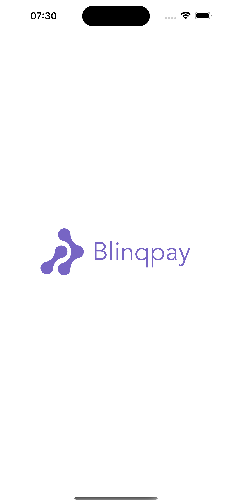
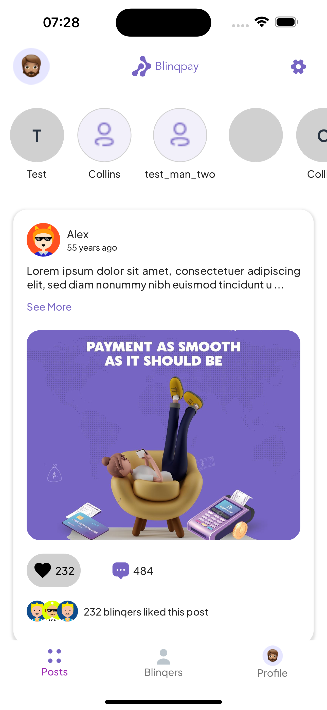
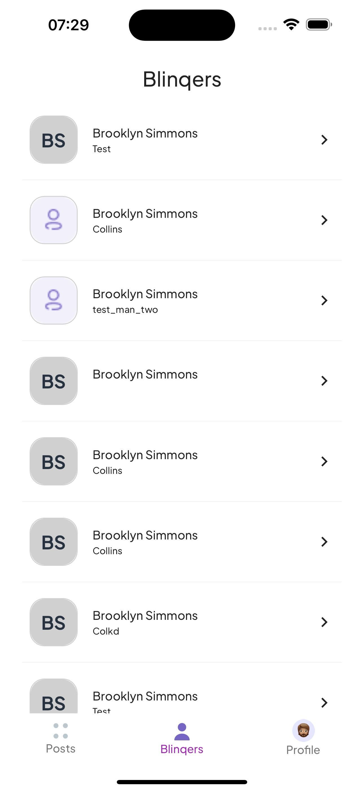
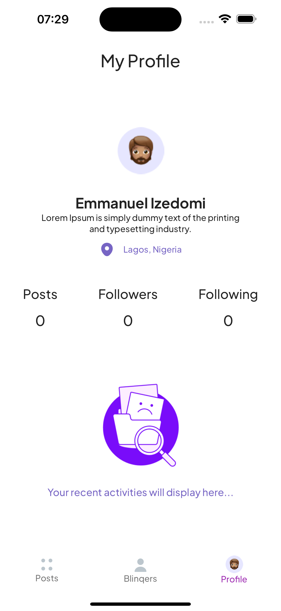
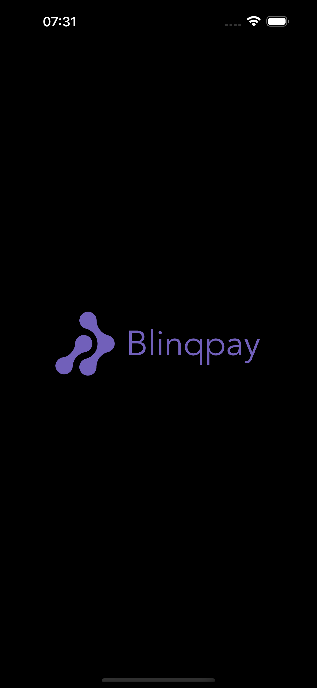
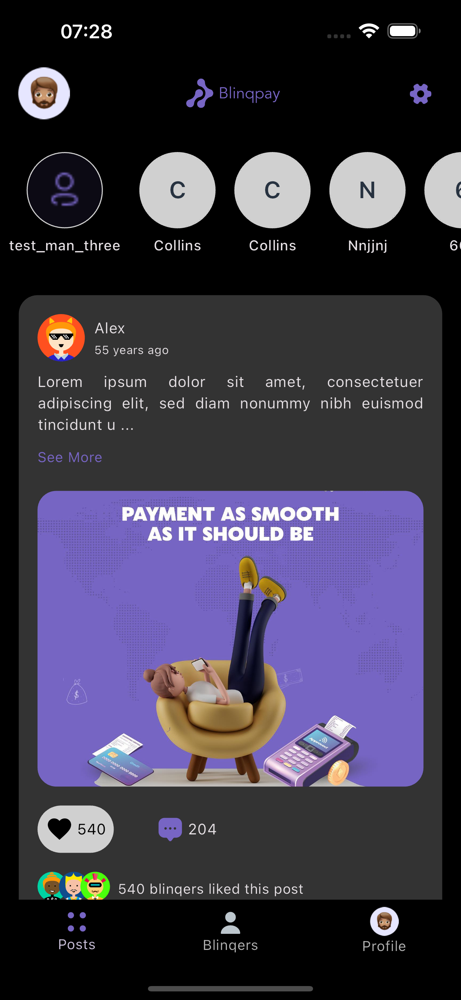
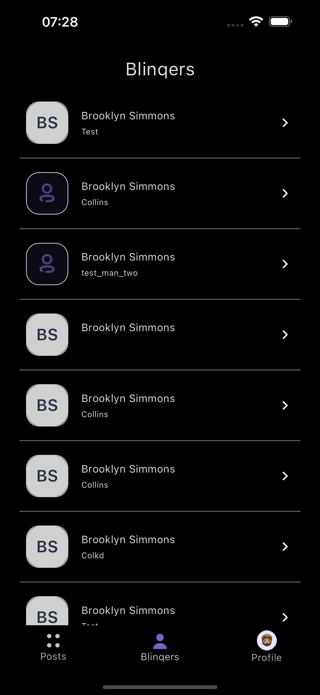
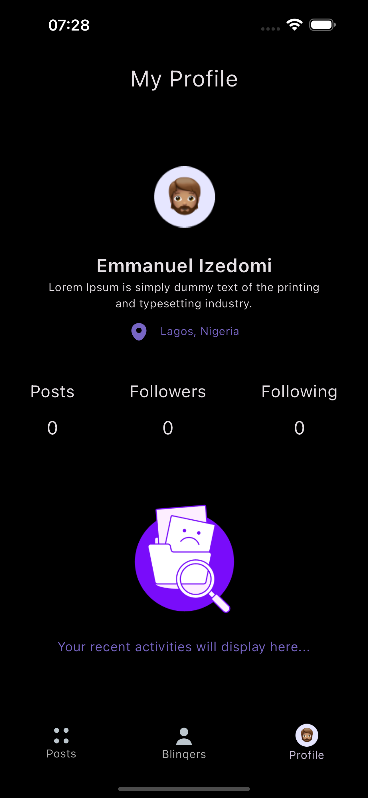

# Blinqpay Assessment
Create a simple flutter app that fetches a collection of posts and users from Firebase Firestore. You are
free to use any design pattern (preferably MVVM) and a proper state management approach.

&nbsp;
## Project Considerations
- Functional requirements
- Non-Functional requirements
&nbsp;&nbsp;

## Functional Requirements
- We want to see how you would approach UI/UX and will be evaluating the app for creativity and
quality of the user interface and experience
- The video should only start playing when it becomes visible to the user, ensuring that the video is
fully in view. It should stop playing if the user has scrolled past it.
- Unit testing the business logic.
&nbsp;&nbsp;
## Non Functional Requirement
### Performance
    Mobile application should respond to users input promptly, prevent memory leaks and should run smoothly on both Android & IOS
### Responsiveness
    Application should be responsive across all device screen sizes. 
### Scalability & Robustness 
    Apply SOLID & DRY principles to ensure scalability and robustness of code
### Clean and readable code
    Use clear naming conventions for variables and methods
### Adaptiveness
    Support a wide range of devices	
### Modularity & Reusability
    Use MVVM architecture for proper seperation of concerns. Use simple functions with single responsibility. Created widget component for UI elements
### State Management
    Manage app state effectively throughout app cycle
### Availability & Caching
    Access app functionalities without internet connection.
### Branding
    Use company logo & colors that emphasize the company's brand
&nbsp;&nbsp;

## Implemented Features and Functionalites
- Simple, clean and easy to use interface
- Animations and micro interactions for better UX
- List of all posts and post types (text, video, image)
- List of users (refered to as blinqers😉)
- Like and unlike a post by double tapping on a post
- Video post content plays if fully visible and stops playing once user scrolls past it
- Simple toast message when there is no internet connection
- Caching: Users can navigate the application without the internet connection. See posts and users list from local cache.
- Personal profile and engagements
- Blinqers profile by clicking on a blinqer(user)
— Dark and Light theme mode selection for users
— Theme mode selection persistence
— Unit test for business logic

&nbsp;&nbsp;&nbsp;

## Light Mode

  
  
  
  

## Dark Mode

  
  
  
  

- [Blinqpay.io](https://blinqpay.io/)
- [Blinqchat.io](https://blinqchat.io/)
    

